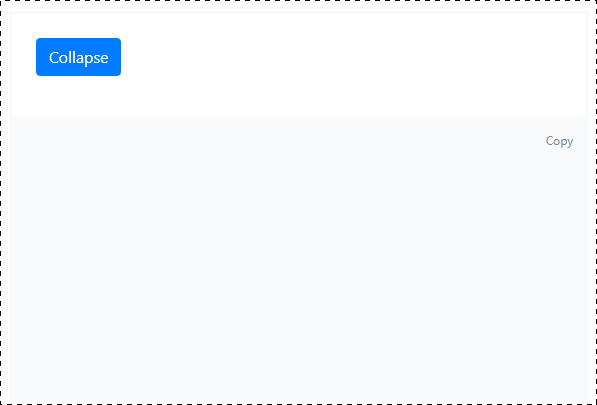

## CI  [[Github Pages](https://zoomzoom2.github.io/Ahj-Animations/)]
---

### Collapse

#### Легенда

В рамках реализации большого портала вам необходимо сделать виджет "collapsible"-контейнеров, который может разворачиваться и сворачиваться.

#### Описание

Подобный виджет есть в рамках Bootstrap, но как мы с вами "знаем": "jQuery не нужен", поэтому вам нужно реализовать такой же виджет на чистом JS.

Авто-тесты на данную задачу не нужны.
